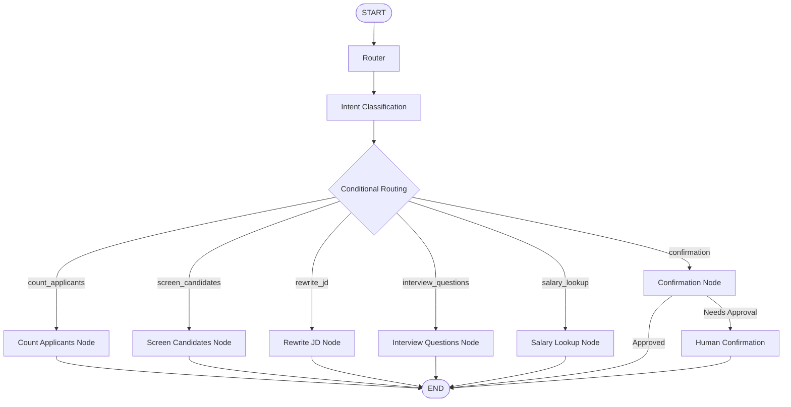
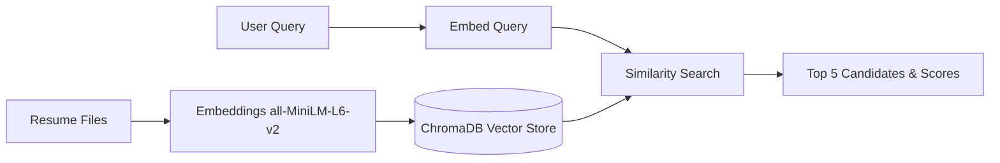

# Recruitment Agent

Recruitment Agent is an autonomous, stateful backend terminal assistant built for the Agentic AI Bootcamp Hackathon. Leveraging LangGraph and ChromaDB, the assistant automates the end-to-end recruitment process. It screens plain-text resumes, rewrites job descriptions based on tone, generates technical and behavioral interview questions grounded in candidate experience, performs web searches for real-time market salary data, and supports human-in-the-loop shortlisting confirmation.

---

## 🚀 Features

- **Stateful Agentic Workflows**: Orchestrated using LangGraph to preserve context and state transitions recursively across conversation turns.
- **Resume Screening via RAG**: Integrates local vector search using ChromaDB and SentenceTransformers (`all-MiniLM-L6-v2`) to retrieve the top 5 candidates with similarity scores. (Bypasses LLM for search querying).
- **Intelligent RAG Explanations**: Utilizes OpenAI GPT models solely after search retrieval to explain exactly why candidates align with the role.
- **Job Description Rewriting**: Rewrites job description documents in `data/jd.txt` to align with a requested corporate tone (e.g., startup, enterprise, casual).
- **Grounded Interview Questions**: Automatically generates 3 technical and 2 behavioral questions grounded in a candidate's specific resume experience and job requirements.
- **Tavily Salary Lookups**: Fetches real-world compensation numbers (average salary, ranges, and trends) using the Tavily Search API. (Bypasses LLM).
- **Human-in-the-Loop Shortlisting**: Intercepts finalizing actions, requesting approval via `"Do you want me to finalize this shortlist?"` before updating the confirmation state.
- **Rule-Based Routing**: Fast, pure-Python classification of user intents to avoid LLM cost and speed overhead during routing.
- **Terminal UI**: Colored output panels showing **Current Intent**, **Current Node**, **Tool Executed**, and responses rendered using Rich.

---

## 🛠 Tech Stack

- **Python**
- **LangGraph** (Stateful orchestration)
- **LangChain** (LLM interface integration)
- **OpenAI API** (Text rewriting and generation)
- **ChromaDB** (Vector database storage)
- **Sentence Transformers** (all-MiniLM-L6-v2 local embeddings)
- **Tavily API** (Salary search web tool)
- **Pydantic** (Data models)
- **Rich** (Terminal rendering)
- **python-dotenv** (Environment configuration)

---

## 📁 Project Structure

```
Recruitment-Agent/
│
├── app.py              # Application entrypoint (interactive terminal UI)
├── graph.py            # LangGraph workflow, nodes, and compiled StateGraph
├── router.py           # Pure-Python classifier for query intent routing
├── state.py            # TypedDict State schema containing exactly 8 keys
├── requirements.txt    # Project dependencies
├── .env                # Local environment variables
├── .env.example        # Environment template file
├── README.md           # Documentation
│
├── agents/
│   ├── __init__.py
│   └── jd_parser.py    # LLM Job Description structured parser
│
├── tools/
│   ├── __init__.py
│   ├── db_tool.py      # ChromaDB manager using SentenceTransformers
│   └── search_tool.py  # Tavily Web Search API client wrapper
│
├── data/
│   ├── jd.txt          # Job Description text file
│   └── resumes/        # Directory containing plain text resumes
│
└── vectordb/           # Persisted ChromaDB index files
```

---

## ⚙️ Installation

1. **Clone the repository**:
   ```bash
   git clone <repository_url>
   cd sttp/
   ```

2. **Create a Python virtual environment**:
   ```bash
   python -m venv .venv
   ```

3. **Activate environment & Install requirements**:
   - On Windows:
     ```powershell
     .venv\Scripts\activate
     .venv\Scripts\python.exe -m pip install -r Recruitment-Agent/requirements.txt
     ```
   - On Unix/macOS:
     ```bash
     source .venv/bin/activate
     pip install -r Recruitment-Agent/requirements.txt
     ```

4. **Configure Environment Variables**:
   Copy `.env.example` to `.env` in the `Recruitment-Agent/` folder and insert your keys:
   ```bash
   cp Recruitment-Agent/.env.example Recruitment-Agent/.env
   ```

5. **Run the Project**:
   ```bash
   .venv\Scripts\python.exe Recruitment-Agent/app.py
   ```

---

## 🔑 Environment Variables

The project requires a `.env` file placed inside the `Recruitment-Agent/` root directory containing:

- `OPENAI_API_KEY`: Required for JD rewriting and interview question generation.
- `TAVILY_API_KEY`: Required for salary lookups and market trends queries.

---

## 💬 Example Usage

Here are example conversations you can run directly inside the terminal:

- **Count applicants**:
  - `How many applicants?`
- **Retrieve candidate ranking**:
  - `Get top candidates for AI Engineer`
- **Toned Job Description rewrites**:
  - `Rewrite this JD for a startup`
- **Candidate questions**:
  - `Generate interview questions for Sarah Connor`
- **Salary lookups**:
  - `Salary expectations for AI Engineer in Hyderabad`
- **Human confirmation flow**:
  - `Finalize shortlist`
  - `yes`

---

## 🔄 Agent Workflow



---

## 📚 RAG Pipeline



---

## 🔮 Future Improvements

- **PDF Resume Parsing**: Add native extraction of text directly from binary PDF files.
- **Gmail Integration**: Automate candidate scheduling notification emails.
- **Calendar Integration**: Synchronize and book meeting slots using Google Calendar or Outlook.
- **Interactive UI**: Develop a Streamlit or React web UI wrapper for easier recruiter interaction.
- **Multi-Agent Collaboration**: Add specialized agents for compliance vetting, background checking, and salary negotiation.

---

## 📄 License

This project is licensed under the MIT License - see the LICENSE file for details.

---

## 👤 Author

- **Name**: [Your Name]
- **GitHub**: [https://github.com/yourusername](https://github.com/yourusername)
- **LinkedIn**: [https://linkedin.com/in/yourprofile](https://linkedin.com/in/yourprofile)
